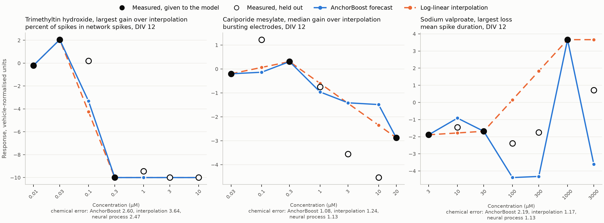
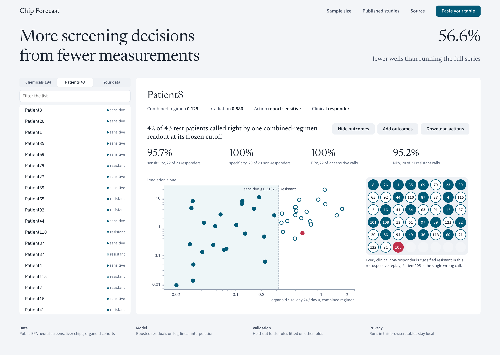

# More screening decisions from fewer measurements

From three measured concentrations, AnchorBoost reports an activity call for **946 of 965** held-out designs; a calibrated rule that reads only the measured concentrations reports **806**. The forecast-based rule uses **15.24% fewer exposure-well equivalents** (11,588 against 13,671; completing every series costs 28,080), with 77 and 75 wrong reports. The evaluation is retrospective, on the EPA rat-neuronal network-formation MEA screen, with training, calibration and test drugs kept apart.

[Technical report](technical_report.pdf) · [Interactive workbench](https://logxio.github.io/ooc-evaluation-audit/workbench/)

## Run three concentrations, get the whole curve

Measure three concentrations of each compound, the highest among them, list the concentrations you have not run yet with an empty value, and drop the table in:

```sh
python -m pip install -r requirements.txt
python three_point.py my_plates.csv
```

`my_plates.csv` has one row per well and endpoint, with the columns `compound, concentration, unit, endpoint, value, plate, date`; vehicle wells have concentration 0, and completed compounds of the same endpoint in the file train the model. Each unfinished compound comes back with a forecast and a 90% interval at every concentration still to run and one next step: report the active or inactive call, add one named concentration, or complete the series. `forecast.csv`, a one-page `summary.md` and `lock.json` (SHA-256 of input, output, model, protocol and code, plus the UTC time) fix the forecast before the plates are read; `--reconcile` then checks it against the finished series, concentration by concentration. A table of completed series is replayed instead: calls made, wrong calls and wells saved against the full series. Viability, albumin, MEA and imaging readouts all work, from chips, organoids or well plates.

On a screen none of our models was trained on, the US EPA human neural-cell screen of Harrill et al. (`python three_point.py --example epa_dnt` writes it in this format), forecasts for 107 unfinished series (15 compounds, 9 endpoints) came back in about a minute on a laptop CPU. Revealed after the lock, **2,318 of 2,520 hidden wells (92.0%) fell inside the 90% intervals**; 53 series were called before they were finished, 2 of them wrong, and the next steps used **35.6% fewer wells** than running every series to the end ([summary](three_point_example/forecast/summary.md), [check against the finished series](three_point_example/forecast/reconcile.md)). Replaying viability and neurite length (71 compounds, 545 three-concentration designs) takes about a minute: 172 early calls with 16 wrong, against 39 wrong for the same calibrated rule reading the measured concentrations alone ([replay](three_point_example/replay/summary.md)).

## Forecast the concentrations a chip screen has not measured yet

A neurotoxicity laboratory screens each new chemical on 48-well microelectrode-array plates of rat cortical neurons and records 17 network features on development days 5, 7, 9 and 12. A full series costs seven concentrations in triplicate. **AnchorBoost** takes the concentrations already measured and forecasts every unmeasured concentration for all 68 day-by-feature outputs with a calibrated 90% interval, and returns a per-chemical error table against the strongest published baselines. Its training principle is **exhaustive design supervision**: every sparse design a laboratory could run on a training chemical is a supervised example.

| 194 held-out chemicals, 3 of 7 concentrations measured | Error against measured responses | AnchorBoost minus comparator, paired 95% interval | Chemicals where AnchorBoost is closer |
|:--|--:|--:|--:|
| **AnchorBoost** | **1.161** | | |
| Published conditional neural process, same folds and context designs | 1.194 | -0.033 [-0.070, -0.001] | 54.1% |
| Log-linear interpolation, strongest published baseline | 1.345 | -0.185 [-0.217, -0.154] | 88.7% |
| Analog chemicals | 1.349 | -0.189 [-0.216, -0.162] | 90.7% |
| Hill curve per output | 1.457 | -0.296 [-0.329, -0.264] | 95.9% |

On the 194 chemicals of folds 1–4, never used for any modelling choice, AnchorBoost's error is **13.7% lower than log-linear interpolation**, the strongest published baseline, and on par with or slightly better than the published conditional neural process of another public submission on identical folds and context designs: 2.8% lower on the registered run (paired interval [-0.070, -0.001]), and −0.069 to +0.001 when folds 1–2 are rerun on macOS, where tree training is not bitwise identical. The resampling unit is the chemical. AnchorBoost is closer than log-linear interpolation in every fold and for 89% of chemicals; against the neural process the median per-chemical difference is −0.012, the largest gain is colchicine (−2.23) and the largest loss sodium valproate (+1.06). Errors are in the variance-stabilised, vehicle-normalised units of the published benchmark, averaged over the five published context designs per chemical.



**Half the measured wells for the same forecast error.** From two measured concentrations (6 wells) AnchorBoost forecasts the other concentrations with error 1.252; log-linear interpolation needs four measured concentrations (12 wells) to reach 1.254 (paired -0.001 [-0.043, +0.043]) and reaches 1.345 with three (-0.093 [-0.139, -0.046]). Against interpolation at the same count the gain grows as fewer concentrations are measured: 26.4% lower error with one and 19.1% with two. AnchorBoost's mean error is also below the published neural process at every count (1.393 versus 1.421, 1.252 versus 1.283, 1.161 versus 1.194, 1.112 versus 1.143 with one to four measured); the paired intervals exclude zero at three and four measured (four: -0.031 [-0.061, -0.003]) and include zero at one and two.

**Exhaustive design supervision is the gain.** A forecaster of unmeasured concentrations is deployed on whatever sparse design a laboratory measured, so it is trained on exactly that task: all C(L,k) subsets of every training chemical's L concentrations, about 2.6 million labelled residuals over log-linear interpolation per fold at three measured concentrations, learned by one gradient-boosted tree model. A conditional neural process samples context sets; enumeration covers the whole design space a laboratory can run. On folds 1–4 the error falls monotonically as each training chemical contributes more designs, 1.176, 1.174, 1.166 and 1.161 with 5, 10, 20 and all of them, and the difference to the neural process grows from −0.018 [−0.054, +0.013] to −0.028 [−0.056, −0.001] and −0.033 [−0.070, −0.001] ([protocol](chip_forecast_designcurve_protocol.json), [result](chip_forecast_designcurve.json)). Training on the five published designs only adds 0.022 [+0.009, +0.037], the largest single ablation. The other prespecified ablations, each retrained per fold against the full model's 1.161: without the analog-chemical deviation 1.180 (+0.019 [+0.011, +0.029]); without the interpolation anchor 1.169 (+0.009 [-0.007, +0.034]); without the Hill deviation 1.165 (+0.004 [-0.001, +0.010]).

**Intervals as wide as each forecast's difficulty.** A quantile gradient-boosted width model learns, from the other folds' held-out errors, how far a well can fall from the forecast given only what was measured: distance to the nearest measured concentration, replicate spread and activity at the measured ones. Cross-conformal calibration on the other folds sets the 90% level. Under a [protocol](chip_forecast_intervals_protocol.json) public in commit `b347731` before folds 1–4 were scored, the intervals cover 0.900 [0.895, 0.905] of 964,187 held-out wells with mean half-width 3.74, 11% narrower than one quantile per output (ratio 0.892 [0.873, 0.911]; [result](chip_forecast_intervals.json)). The published neural process reports 3.71 at 0.899 coverage, with intervals scaled by its ensemble spread and stratified by a chemical-level cytotoxicity call from the full viability series; ours use the measured concentrations only. The committed width forecast, 3.40–3.73, was missed by 0.01.

**From forecast to decision.** After three concentrations a laboratory needs a call, active or inactive over the full series, or a reason to measure the rest. The forecasts feed the same calibrated release rule that produces the patient report list below ([`matched_regimen.py`](matched_regimen.py)): training folds fix the cutoff, calibration folds fix the release margin at a 10% wrong-call budget, and every other design is sent to the full series. In the primary evaluation, five outer folds keep parent drug identities apart across training, calibration and test (188 drug groups, 193 substance labels, 965 designs): the chain reports 946 designs against 806 for the measured concentrations alone, with 15.24% fewer exposure-well equivalents and 77 against 75 wrong reports (technical report, Section 4.2). The earlier replay on the 194 held-out chemicals (970 designs, technical report Appendix B.3) decides **93.3%** of designs from three concentrations against 73.3% for the measured concentrations alone, at the same realized wrong-call rate (8.1%, 79 designs each): +20.0 points [16.0, 24.1]. It measures 56.6% fewer wells than the full series, against 45.5% (+11.1 points [8.6, 13.8]); when every call is released it is wrong for 10.5% of designs against 14.9% (−4.4 points [−6.8, −2.3]). Protocol public in commit `7154bec` before folds 1–4 were scored; every committed forecast held ([protocol](chip_forecast_decision_protocol.json), [result](chip_forecast_decision.json)). `python chip_forecast_actions.py --analyze chip_forecast_runs/decision_fold*.npz` writes the [action list](chip_forecast_actions.csv), one row per held-out chemical design: report the call from three concentrations (905 designs) or measure the full series (65).

**A second, independent screen, no change.** The frozen model, features and hyperparameters were run unchanged on the US EPA acute MEA screen (384 chemicals, one-hour exposure of mature networks, 43 network parameters, three independent culture runs; 290 chemicals outside the developmental set). Over all five chemical folds AnchorBoost scores **1.554 against 1.814 for log-linear interpolation (−0.260 [−0.281, −0.238], 14.3% lower, 93.2% of chemicals closer, every fold)**, 1.736 for analog chemicals and 1.915 for Hill curves. The protocol, with a forecast of 4–15% lower error, was public in `7154bec` before any model was trained on these data ([protocol](chip_forecast_acute_protocol.json), [result](chip_forecast_acute.json)).

**A third screen, in human neural cells, no change.** The same frozen model ran unchanged on the US EPA developmental-neurotoxicity screen of Harrill et al. (2018): human hNP1 neural progenitors (caspase apoptosis, CellTiter viability, three proliferation readouts) and human hN2 neurons (neuron count, neurite length, neurite count, branch points), 71 chemicals at up to 11 concentrations on three replicate plates, read by high-content imaging and plate readers. Over all five chemical folds AnchorBoost scores **1.693 against 1.965 for log-linear interpolation (−0.272 [−0.352, −0.195], 13.9% lower, 77.5% of chemicals closer, every fold)**, 2.113 for analog chemicals and 2.243 for Hill curves. The protocol, with a forecast of 3–20% lower error, was public in `9a15652` before any model was trained on these data ([protocol](chip_forecast_dnt_protocol.json), [result](chip_forecast_dnt.json)); each fold trains and evaluates in about one minute on a free Kaggle CPU.

`python chip_forecast.py` downloads the two pinned public files, verifies their SHA-256, reproduces the published baseline errors (log-linear within 0.0001 for all 243 chemicals at every measured-concentration count), trains one model per held-out fold and writes the per-chemical CSV. Features and hyperparameters were chosen on fold 0 only; the [frozen protocol](https://github.com/logxio/ooc-evaluation-audit/blob/2b4c20e/chip_forecast_protocol.json), with code hash, a log of every configuration tried on fold 0 and a numerical forecast, was public in commit `2b4c20e` before folds 1–4 were evaluated. [Amendment 1](https://github.com/logxio/ooc-evaluation-audit/blob/main/chip_forecast_protocol_amendment_001.json) handles a single measured concentration and leaves every feature array at two to four measured concentrations identical. Each fold trains and evaluates in about four minutes on a free Kaggle CPU. Five further point-forecast mechanisms tried on fold 0 (analog design replay, self-replay features, cross-size episodes, replicate-well spread, a three-member ensemble) changed the error by at most 0.0031 ([log](chip_forecast_runs/development_fold0.json)), and self-check-scaled intervals and self-check-ranked remeasurement failed their prespecified tests on folds 1–4 ([protocol](chip_forecast_selfcheck_protocol.json), [result](chip_forecast_selfcheck.json)). `chip_forecast_runs/` holds the per-fold outputs from which `chip_forecast_designcurve.py`, `chip_forecast_selfcheck.py --analyze`, `chip_forecast_intervals.py`, `chip_forecast_decision.py --analyze`, `chip_forecast_acute.py --merge` and `chip_forecast_dnt.py --merge` recompute these results.

## Use the patient workbench

An organoid or tumour-chip researcher can load a coded patient table and obtain a research report list, a retest list and the source evidence behind each action. Load the saved rule for the same study and assay to reveal observed clinical errors and export patient-level actions. Use the changed calls to choose which measured signal to carry into the next validation batch, and freeze that batch’s predictions before opening its outcomes.

[Open the workbench source](https://github.com/logxio/ooc-evaluation-audit/tree/main/workbench) and [download the combined-regimen result](https://github.com/logxio/ooc-evaluation-audit/raw/refs/heads/main/patient_workbench_result.json). Open `workbench/index.html` from the downloaded repository, by double-click or from any static server: **Load 43 published patients** draws the 43 patients as wells of a 48-well plate (filled wells are reported, outlined wells go to retest), **Reveal outcomes** turns the two-readout rule's 4 wrong reported calls red in place and sets it beside the fixed combined-regimen threshold (1 wrong of 43), and **Download patient action list** exports the rows. Three clicks take the built-in table from loading to the downloaded list in 336 ms (median of five headless-browser runs, each click followed by a page snapshot; reading time not included). To open another result, choose **Rule and study → Open updated result packet** and select `patient_workbench_result.json`. A compatible new table follows `python patient_workbench.py --csv patients.csv`; the same control opens its result. Measurements stay on the reader's computer.



The primary rule uses one measured combined-regimen assay from the published rectal study. On the fixed 43-patient test split it returns **43 reports, one wrong call and zero retests**, versus **27 reports, four wrong calls and 16 retests** for the earlier agreement rule. At a retest cost of 0.25 relative to one wrong call, total loss is **1 versus 8**. These are measured errors plus an explicit cost assumption. Original investigators produced the assays; our contribution selects, freezes, compares and delivers the signal as a usable patient action list.

| Evidence a researcher can inspect | Result | What it supports |
|:--|:--|:--|
| Same clinical treatment components, 36 rectal patients | Combined signal 36 reports/1 wrong; earlier agreement 20/3; coverage **+44.44 percentage points, paired 95% interval [27.78,61.11]** | Signal construction and regimen matching improve this retrospective reporting workflow |
| Two newly accessed publications, 45 clinically paired patients | **19 primary test patients** had model predictions frozen before the relevant outcome values were read: pancreatic 7, lung 12 | A staged, outcome-value-blind test of frozen decisions, with source-specific endpoints |
| Browser and CLI action lists | Original chain: 568 numeric comparisons passed; new primary packet: 43 patient actions and both score columns match the CLI | Researchers and reviewers can reproduce the actual output |

The strongest single-component comparison keeps its registered result: on the matched 36 patients it releases 12 with six errors and exceeds the common 10% overall-error budget, so the equal-risk primary comparison fails. The fixed combined-signal threshold itself already yields 43/1; calibration adds zero observed gain. The 36-patient result is the prespecified secondary comparison on previously analysed data, with 5-FU acting as the capecitabine assay proxy. The seven additional patients in the 43-person sensitivity lack clinical irinotecan. This table lets a researcher choose a supported signal, inspect failures, and size a validation batch with the relevant endpoint.

## What changes in the next research batch

The [43-row action comparison](https://github.com/logxio/ooc-evaluation-audit/blob/main/patient_action_delta.csv) identifies exactly what the combined-regimen signal changes: **16 earlier retests become correct reports, four earlier errors become correct calls, one new error appears, and 22 calls stay unchanged**. Patient35 moves from retest to a correct sensitive report; Patient97 changes from an incorrect resistant call to a correct sensitive call. Patient105 moves from a correct sensitive call to the new rule’s only incorrect resistant call. The researcher can carry these coded rows into an assay-discordance review and record which endpoint or measurement needs checking before the next independent batch.

`python patient_action_delta.py` regenerates the JSON and CSV. At the stated retest cost of 0.25, the observed action counts reduce gross loss by seven wrong-call equivalents. If the combined assay must be added for every patient, its additional cost must be below **7/43 = 0.16279 wrong-call equivalents per patient** for this comparison to retain a net benefit. For example, `--added-assay-cost 0.20` returns a net loss increase of 1.6 units for the batch. This gives a laboratory an explicit measurement-cost question to answer; staff hours, currency savings and clinical treatment effects remain unmeasured. The fixed combined threshold gives the same calls, so this is the value of the measured signal and its delivery.

## An additional external clinical replay with eligibility frozen first

[Cartry et al. 2023](https://doi.org/10.1186/s13046-023-02853-4) supply a CC BY 4.0 spreadsheet from a separate French colorectal-cancer programme. All 11 Supplementary Table 3 rows enter the eligibility record. Before opening individual clinical outcomes, we freeze the **five metastatic patients** as the primary set and route all **six adjuvant patients** to clinical-linkage review, because surgical disease removal and drug benefit share that endpoint. The source-specific rule predicts benefit when the largest reported component score is **strictly greater than 1.9**, the paper’s fixed hit threshold. This uses component scores from this source; the rectal combined-assay cutoff 0.31875 remains attached to the rectal assay.

The [public prediction freeze](https://github.com/logxio/ooc-evaluation-audit/blob/954df7d/clinical_external_frozen.json), SHA256 `ed435ef3eb8805182317bf6572c1ce40739dcceee3c870e2a5fceea8d8d001a5`, contains three benefit calls and two no-benefit calls. The protocol specifies partial response or stable disease versus progression, the always-no-benefit comparator, Wilson intervals, a paired exact test and a sensitivity excluding the two drug-proxy regimens. The publication’s aggregate 75% sensitivity/specificity in eight evaluable patients had already been read; individual outcome columns remained concealed until the manifest and code were published. This is a retrospective, aggregate-exposed replay with predictions publicly committed before individual outcome values were opened. The same analyst controlled concealment; independent adjudication and clinical prospective enrollment remain future work.

| Frozen source-specific evaluation | Patients | Correct / wrong | Always no benefit | Always benefit, post-unblinding diagnostic |
|:--|--:|--:|--:|--:|
| All metastatic patients | 5 | **4 / 1** | 1 / 4 | 4 / 1 |
| Exact-drug sensitivity, two proxy regimens removed | 3 | **2 / 1** | 0 / 3 | 3 / 0 |

Primary accuracy is **80%**, with a Wilson 95% interval **37.55%–96.38%**. The prespecified paired improvement over always no benefit is 60 percentage points (three wins, zero losses; exact McNemar p=0.25). Class imbalance lets always benefit match the primary accuracy and outperform the exact-drug sensitivity. The result supports an executable, source-specific five-patient research replay; larger calibrated clinical prediction gains remain to be established. The one wrong call, **CGR0010**, predicts no benefit whereas the table records partial response. `python clinical_external.py score` downloads the checksum-verified original, checks every frozen rule and prediction, then writes the [five-row result](https://github.com/logxio/ooc-evaluation-audit/blob/main/clinical_external_result.csv) and six linkage-review records. The source’s numerical predictors were developed by its authors. Our contribution freezes eligibility and actions, verifies the source, and exposes individual errors and the comparison.

The five-patient error fraction is 20%. It adds one independent publication to the validation evidence, with its own clinical-benefit endpoint and aggregate-exposure record. Its accuracy remains separate from the 19 earlier primary pancreatic/lung test patients and the retrospective 43-patient rectal signal comparison. Boilève 2024 supplements remained inaccessible (HTTP403); Smabers 2024 publishes curves and requests an application for underlying numerical data. Both contribute zero new evaluated patients here.

The additional [External Clinical Action Replay Notebook](https://www.kaggle.com/code/loxigicck/external-clinical-action-replay) has official **COMPLETE**, seven cells, on free Linux CPU. It downloads the original clinical spreadsheet, regenerates the frozen five-patient evaluation and the 43-row action CSV, and checks exact equality with both saved results. This supplements the existing 70-cell Notebook v14. Computational reproduction and independently conducted laboratory validation remain separate evidence categories.


## Published study checks

Patient-derived organ-on-chip tests are being used to rank cancer drugs and dosing schedules for individual patients. This toolkit checks whether a chip readout is ready to act on before it drives that choice. Each check ends in one of four actions: **release** the call, **retest** with another readout, **wait** for a later readout, or mark the accuracy claim **unlinked** to any evaluable outcome. Every check runs on free CPU from the original publisher files of five published physical-chip studies, one patient-spheroid assay and patient-organoid studies.

| Action | Real data | What the check found | Run |
|:--|:--|:--|:--|
| Release or retest | Dai et al., 22 colorectal cancer patients | Calls released only when vessel and tumoroid agree: **20/22** released, **19/20** correct; both retests are patients the prespecified two-channel mean gets wrong | `python channel_consensus.py` |
| Release or retest, independent cohort | Osteosarcoma patient organoids, 13 post-treatment samples, 5-year outcome | The same rule, unchanged, releases **11/13** calls with **10** correct, against 11/13 for either readout alone | `python consensus_external.py` |
| Release or retest, blind test | Gastric and biliary patient organoids; predictions published before outcomes were read | Biliary: **7** calls released, **6** correct, fewer errors than either drug alone; gastric, where each drug alone is near chance: 9 released, 4 correct | `python blind_consensus_score.py` |
| When release pays | The six release settings above | Under independent errors, agreement improves accuracy when both readouts exceed chance (**5/6** settings sorted); each readout's own accuracy forecasts released accuracy with mean error **0.044** | `python release_theory.py` |
| Release or retest, second blind test | Rectal cancer (85 patients, chemoradiation) and colorectal liver-metastasis (23 patients, FOLFOX or FOLFIRI) organoids; patient calls, formula and tolerance frozen first; numerical formula inputs calculated after outcomes | Rectal: **50** released, **43** correct (formula 0.863, observed 0.860); liver metastasis: **15** released, **14** correct (formula 0.928, observed 0.933). An organoid readout of the combined chemoradiation alone gets 78 of 86 rectal patients right | `python blind2_score.py` |
| Release or retest, third blind test | Tan et al. 2023, 22 treatments in 18 colorectal-cancer patients; all 101 assay-patient predictions frozen first | **13** calls released, **10** correct; formula 0.803, observed 0.769. Better single readout: 17/22; combination: 16/22. Agreement improves loss over the better single readout only below retest cost **2/9** | `python blind3_score.py` |
| Frozen-model risk control | Three independent organoid publications | Disjoint training/calibration/test; at 10%, wrong releases **4/43, 0/9, 0/6**, with release counts **27, 0, 0**. Expected overall risk control under exchangeability; larger-calibration failures and coverage are reported | `python calibration_replay.py` |
| Newly frozen pancreatic predictions | Tiriac et al. 2018; 50 independent reference patients, 9 clinically paired patients, 7 prespecified primary patients | Forecast 4 releases/3 retests/70.83% accuracy; observed **4/0 wrong**, versus fixed anchor **7/2 wrong** and frozen mean ranks **7/0 wrong**. Outcome values unread before public freeze; figure-layout exposure recorded. Conditional 10% certificate coverage stays zero | `python tiriac_reproduce.py` |
| Newly frozen lung test | Wang et al. 2023; 36 patients split 12 training/12 calibration/12 test before labels, opened stage by stage | Both learned and equally calibrated fixed cutoffs release **4/12 with 1 wrong**: 8.33% overall, 25% among releases. Forecast accuracy91.67%, actual75%; method coverage gain0. Conditional certificate releases nobody | `python lung_reproduce.py` |
| Combined-treatment signal comparison | Same previously seen rectal42/42/43 split | Combined assay releases **43 with 1 wrong**, versus component agreement27 with4 wrong. Fixed-threshold baseline matches43/1. Calibration zero-error subset26 falls short of29; 23/127 clinical regimens omit one assay drug | `python matched_regimen.py` |
| Retest | Steinberg et al., spheroids from 10 patients | Area and viability disagree in **14/49** patient-drug pairs; area alone misses **12/40** viability drops | `python assay_discordance.py` |
| Wait | Schuster et al., 3 pancreatic cancer patients | **8/48** schedule contrasts reverse between 24 and 72 hours; an early forecast loses to carrying the 24-hour value forward (MAE **0.4071** vs **0.1526**) | `python schedule_horizon.py` |
| Wait, then flag attrition | Petreus et al., tumour-on-chip vs mouse xenograft | The chip's schedule ranking is confirmed in mice only at day 35 (**0/3** inverted pairs); the confirmation rests on 20 of 45 mice and fails a worst-case check on the missing values | `python horizon_attrition.py` |
| Release, confirmed in vivo | Zhai et al., author-defined chip-effective and chip-ineffective mouse treatment arms | The certificate, frozen before these data were analyzed, confirms chip-effective over chip-ineffective arms from the **3rd** administration (7 vs 7 mice) and the **2nd** (5 per arm); between-arm pairwise concordance **0.98** at the last complete administration; the last administrations are flagged for attrition | `python horizon_attrition.py` |
| Unlinked | Hu et al., 21 lung cancer organoid lines | The published ten-of-ten clinical agreement covers **10/21** tested lines | `python clinical_linkage.py` |

Among the rules reported here that never use the held-out patient's outcome, the consensus gate has the lowest loss whenever a retest costs less than half of a wrong call; only the vessel channel chosen after seeing all 22 outcomes (21/22) does better. Run unchanged on an independent osteosarcoma organoid cohort, it again beats either readout alone below the same break-even retest cost of 0.5; on pre-treatment samples, where both readouts are near chance, the calls it releases are right 3 times out of 6. The consensus rule was designed after exploring this cohort, so it needs a prospectively registered cohort before clinical use; only the 17/22 two-channel mean was fixed before effects were seen. The [competition-linked chip notebook](https://www.kaggle.com/code/loxigicck/chip-decision-contract-map) runs the earlier checks on free Kaggle CPU from the original sources, and the [technical report](technical_report.pdf) gives every denominator, selection history and source license.

The same discipline is tested at scale on neural-organoid single-cell data: a fixed classifier reaches **0.9374 macro-F1** on 236,453 cells from a third laboratory, **+0.1223** over a nearest-centroid baseline, and a 20% review budget on all **263,827** of that laboratory's cells exposes **17,046/34,656** later label disagreements.

A **Review Contract Map** records which organoid cells are eligible for a review queue, the score-only sample-key order, how later reference labels define findings, and what a fixed review budget misses. A fixed model trained on [Velasco's neural organoids](https://doi.org/10.1038/s41586-019-1289-x) reached **0.9078 macro-F1** on **207,871 Bhaduri cells** and **0.9374** on **236,453 HNOCA-selected Uzquiano cells**. These are different acquisition publications within one harmonized atlas, not independently adjudicated biological results. A 20% whole-key budget on **all 263,827 Uzquiano cells** exposed **17,046/34,656** later HNOCA-label findings and missed **17,610**; the full result and its negative Bhaduri contrast are below.

Within the HNOCA cohort already selected by its three class labels, the report ranks sample keys by mean uncertainty from the model's decision-score margins; the **ranking calculation** uses no target labels. In a **retrospective** check on the same 34 Bhaduri keys, this rank correlated with observed key error rate (equal-key Spearman **0.7791**, 2,000-draw key interval **0.5546–0.9010**). The highest-ranked eight keys had **1.721 times** the equal-key mean error rate. After observing this ratio, we kept the top-eight ranks fixed and shuffled the 34 observed group error rates 10,000 times; none matched it (one-sided, plus-one Monte Carlo **p=0.00010**). This conditional, post hoc check does not supply independent labels or a prospective test. Cohort selection did use HNOCA labels, so this is not an end-to-end test on a wholly unannotated batch; the score is not an error probability.

When reference labels are available, a separate error audit shows what to check. Glioblast, HNOCA's neural progenitor cell-type label rather than a tumor diagnosis, is the sharpest example: the model found 2,862 of 3,071 consensus-labeled cells, while **1,353** other cells were incorrectly flagged. One 3,030-cell sample has **8** consensus Glioblast labels and **96** model calls. That example ranks sixth by known-label Glioblast false positives but 27th by the score-only uncertainty queue. Inspect those cells before using a predicted composition as a research result.

A secondary label-and-endpoint check exposes another limit of a single headline score. The [Bhaduri author labels preserved in HNOCA's CC BY cleaned archive](https://zenodo.org/records/14161275) classify **175,160** of the selected test cells unambiguously as Neuron or Radial Glia. On this different two-class endpoint, the fixed model scored **0.9412 macro-F1** (34-key interval **0.9224–0.9566**), while the prespecified nearest-centroid comparator scored **0.9472**. The paired model-minus-centroid interval was **−0.0101 to −0.0025**. The comparator ordering reverses when both the label convention and class endpoint change; this does not isolate which change caused it, and the 0.9412 score is not a new model advantage. These labels come from the same Bhaduri collection and may have informed atlas harmonization, so this is a sensitivity check, not independently blind validation.

The two experiments were collected independently, but the [HNOCA atlas](https://www.nature.com/articles/s41586-024-08172-8) selected its 3,000-gene panel across studies and harmonized their labels. This is a cross-laboratory **acquisition-source** test under a shared panel and annotation, not a blind independent-label validation. `bio_sample` is an atlas key, not a verified physical organoid or donor ID. These neural organoids are not perfused organ-on-chip cultures; the distinct physical-chip and chip-image audits appear below. The [organoid run guide](ORGANOID_PHENOTYPE.md) covers the free-CPU source-to-report route; the [technical report](technical_report.pdf) gives the full protocol, class errors, license attribution, and limits ([source](technical_report.md)).

[HNOCA-tools](https://devsystemslab.github.io/HNOCA-tools/api/mapping/AtlasMapper/) already supports atlas mapping and label transfer, and [Khatri and Bonn](https://proceedings.mlr.press/v179/khatri22a.html) studied uncertainty for single-cell label transfer. This map does not invent those methods or calibrate its margin score as an error probability. Its measured output joins one whole-study holdout, a review order on the same 34 sample keys, and their known-label errors in one reproducible record. A future independently labeled cohort is still needed to test whether this review order transfers.

**Reproduce the main result:** On a free Kaggle Linux CPU with Internet enabled, install [`requirements-organoid.txt`](requirements-organoid.txt) if needed, then run `python organoid_phenotype.py`. The command checks the 2,880,860,613-byte HNOCA original against its published MD5 and writes `organoid_audit/audit.html`, `audit.json`, `groups.csv`, and `review_queue.csv`. The [competition-linked public notebook](https://www.kaggle.com/code/loxigicck/neural-organoid-phenotype-audit-across-labs) v4 ran the optional two-archive route on free Kaggle Linux CPU to script exit **0** in **921.345 seconds**, at **2,550,792,192 bytes** peak resident memory. Its source SHA-256 matches this repository's main script `936fef80…` and original-author module `8cd0e89f…`. An independent output check confirmed the minimal original's MD5, every earlier three-class field and rank result, the 175,160-cell author-label endpoint, and all 34 paired group matrices. The cleaned archive was read by byte ranges and its full published MD5 was **not** recomputed. The [run guide](ORGANOID_PHENOTYPE.md) states the protocol and limits. Source transfer may take longer than computation and requires temporary scratch space.

To include the Bhaduri author-label sensitivity check in the same source-to-report run, use `python organoid_phenotype.py --author-label-sensitivity`. It reads only needed metadata byte ranges of the separate CC BY cleaned archive, verifies that all **223,453** Bhaduri HNOCA row keys match the scoring archive in order, and adds `author_label_sensitivity.json` with class totals, per-key confusion matrices, fixed comparators, and 2,000-draw key intervals. The ordinary command above remains the shorter primary run.

## Fixed-budget review results and reproduction

The selected Bhaduri queue ranked 34 HNOCA-selected sample keys without consulting their labels during ranking. Its top eight had 1.721 times the equal-key mean later disagreement rate. This selected-cohort result did **not** transfer to all Bhaduri rows: after rescoring all 223,453 cells, a 20% whole-key cap reviewed 44,543 cells, exposed **6,881/22,721** later findings, and missed **15,840**. A random key order found at least as many in **19.33%** of 10,000 draws. The [five-contract map and fixed-budget outputs](review_reference/) preserve the changed row and endpoint definitions; run `python review_contract_map.py` and `python fixed_budget.py` to regenerate them from the included small source summaries.

The third publication was selected *before model outcomes* by a fixed HNOCA metadata rule: exclude Velasco and Bhaduri, require 10,000–250,000 selected three-class rows, at least 100 per class, five sample keys, and no key overlap with training; choose the largest eligible publication. This chose **Uzquiano 2022** with 236,453 selected cells and 47 keys. The unchanged Velasco-trained model reached **0.937418 macro-F1** (whole-key interval **0.918595–0.952664**), versus **0.815074** for source-trained nearest centroid; the paired difference was **+0.122344** (interval **+0.099082 to +0.147403**).

On those selected three classes, a separately frozen score-margin queue reviewed 47,228 cells under a 47,290-cell cap, exposed **2,989/7,282** HNOCA disagreements, and missed **4,293**. None of 10,000 random whole-key orders reached its count; a source-trained centroid-distance order exposed 1,759 while reviewing 47,048 cells. A later predeclared replay removed the three-class row filter from the **same Uzquiano publication**, admitting all 263,827 cells. Its 52,765-cell cap let the margin queue review 51,993 cells and expose **17,046/34,656** later findings, including 14,442 outside the three-class endpoint, while missing **17,610**. Only three of 10,000 random whole-key orders reached its total (**0.03% high tail**); centroid distance exposed 9,181 findings while reviewing 51,954 cells. The margin queue found 7,865 more while reviewing 39 more cells. The frozen all-row gates required a random total high tail below 5%, more total findings than distance, and more outside-endpoint findings than the random median; all passed.

These are retrospective disagreements against HNOCA's harmonized labels. HNOCA metadata and class labels helped choose the publication; the same labels define later findings. The full-row result is not an independent cohort relative to the selected-row result, an expert-confirmed error count, a prospective trial, or measured researcher time. The Bhaduri all-row failure remains visible. The metadata gate in `review_contract_gate.py` rejects declared changes to publication, eligibility, score, group, label scheme, or endpoint; matching fields do not prove useful ranking, and the current gate does not verify actual row membership. The real organ-on-chip image audit below is a separate experiment.

The code and [small reference JSON files](review_reference/) let readers inspect each key and rebuild the counts. Use a free Linux CPU with Internet access and the attributed [HNOCA v1 archive](https://zenodo.org/records/15004818). Each script checks its published 2,880,860,613-byte size and MD5; to avoid repeated downloads, pass one verified local file to all three runs in this order:

```sh
python f32_third_source.py --input hnoca_minimal_for_mapping.h5ad
python f36_third_review.py --input hnoca_minimal_for_mapping.h5ad --f32-reference f32_third_source/third_source.json
python f38_full_intake.py --input hnoca_minimal_for_mapping.h5ad --f32-reference f32_third_source/third_source.json
```

The later scripts assert the selected publication, training-row identity, and all 47 selected-key confusion matrices against the first run. The [competition-linked Notebook](https://www.kaggle.com/code/loxigicck/neural-organoid-phenotype-audit-across-labs) embeds these scripts and the Bhaduri map on free CPU. The [technical report](technical_report.pdf) describes the protocol, data permissions and limitations. No raw atlas or chip-image files are redistributed here.

## Physical-chip readout audits

The [competition-linked chip Notebook](https://www.kaggle.com/code/loxigicck/chip-decision-contract-map) v14 has official COMPLETE for all 70 cells, including the corrected Liver-Chip results, combined-regimen packet, pancreatic/lung frozen tests and completed method comparisons. It downloads the publisher files and verifies their hashes; the image comparison starts from checksum-verified derived features. See [the completed-run marker](notebook_complete.json).

**Schedule Decision Horizon** uses [Schuster et al.'s Figure 5a-b source workbook](https://www.nature.com/articles/s41467-020-19058-4#Sec25). Run `python schedule_horizon.py --source original-source.xlsx --out schedule_horizon.json` after installing `requirements-schedule.txt`; the script verifies the original workbook SHA256 and writes a 48-row CSV beside the JSON. There are **8/48** sign reversals between 24 and 72 hours and **13/48** retrospective stability horizons later than 24 hours. The three-patient leave-one-out forecast loses to 24-hour persistence (MAE **0.407105** versus **0.152629**). The horizon uses future data, so it cannot authorize an early stop or treatment decision. The original article is CC BY 4.0 and developed the chip and drug schedules.

**Clinical Holdout Contract** uses [Dai et al.'s published Figure 5 source files](https://doi.org/10.1016/j.xcrm.2026.102873). Install `requirements-chip.txt` and run `python chip_clinic.py`; it fetches the source ZIP and Figure 5 image from PMC, verifies both SHA256 hashes, averages three technical replicates per patient, and prints aggregate patient-held-out classifications. The predeclared optimized vessel/tumoroid mean classifies **17/22** clinical responses, compared with **15/22** for the original-chip mean and **11/22** for an all-resistant rule. The optimized vessel-only channel classifies **21/22** versus **17/22** for original vessel, while optimized tumoroid classifies **19/22**. Vessel-only was selected after examining six readouts; it is an exploratory candidate for a separately registered patient cohort. The original authors built the chips, measured outcomes, and reported optimized **86.36%** same-cohort concordance. Our cutoff audit leaves each patient out of threshold selection; it is still retrospective and single-study. Their article files are CC BY-NC-ND 4.0. This MIT repository contains only our source code and aggregate conclusions, never the original image, workbook, or patient-level clinical table.

**Assay Discordance Contract** runs with `python assay_discordance.py` after installing `requirements-chip.txt`. On the Dai data it chooses among six readouts *inside* each outer patient's other 21 training patients, then fits the training-only threshold. It classifies **20/22**, with the optimized vessel channel selected in 21 folds and the optimized tumoroid channel in one. The procedure was designed after examining the six A9 results; the outer fold protects each individual prediction from direct selection on its own label, but does not make the overall algorithm an independent validation. On [Steinberg et al.'s CC BY 4.0 source workbook](https://doi.org/10.1038/s42003-023-05531-5), it pairs viability and area reduction for each patient and tested drug. Strictly opposite signs occur in **14/49** complete pairs. Area-only screening would miss **12/40** pairs with reduced viability. The article's caption reports n=48; the source workbook contains 49 complete paired cells. We report the workbook denominator and expose this difference. These rows have no unambiguous chip-perfusion flag or exact matching clinical-treatment endpoint, so the script does not report clinical accuracy for this source. The program downloads and checks both articles' source hashes at runtime, prints aggregate results, and keeps patient-level rows local unless `--out` is requested. No raw source workbook is redistributed.

**Clinical Linkage Coverage Contract** runs with `python clinical_linkage.py` after installing `requirements-chip.txt`. It downloads [Hu et al.'s Supplementary Data 2](https://www.nature.com/articles/s41467-021-22676-1#Sec31), verifies SHA256, and reads each unique sample ID and the workbook's gray clinical-comparison marking. The source has **21** tested lines, **10** author-linked and **11** unlinked. The reasons for the latter are eight without evaluable response or subsequent treatment and three with an untested or radiotherapy-confounded regimen. Among the ten linked lines, eight list a post-collection drug and two rely on previous treatment; four of the eight post-treatment regimen strings exactly match a tested agent. That string check is deliberately narrower than clinical drug-class or component matching and does not redefine the authors' eligibility. The article reports 100% accuracy and specificity among its ten selected comparators; our code does not derive a new prediction threshold or count the other eleven as successes or failures. With eleven unknown outcomes, **10 to 21 of the 21** could agree under extreme assignments, so the selected 10/10 cannot establish performance across the tested cohort. This is a second original physical-chip study, not an external test of our Dai algorithm. The article and workbook are CC BY 4.0. Only code and aggregate results are kept in this MIT repository; `--out` writes patient-level audit rows locally if requested.

**Channel Consensus Release** runs with `python channel_consensus.py` after installing `requirements-chip.txt`. On the same Dai source files it fits separate vessel and tumoroid cutoffs on the other 21 patients and releases a held-out call only when both agree; disagreement sends the case to another assay or review. Optimized chips release **20/22** calls, **19/20** correct, and abstain on **2/22**; original chips release **18/22**, **15/18** correct. With a wrong call costing 1 and an abstention costing c, the optimized gate beats the prespecified two-channel mean for c < 2 and the nested channel selector above (20/22 full calls) for c < 0.5; at c = 0.25 it costs **0.068182** per patient versus **0.227273** for the mean. The vessel channel chosen after inspecting all six readouts is better at **0.045455** with full coverage. An abstention is never counted as correct, the costs are illustrative preferences rather than measured patient utility, and the rule was designed after earlier results from these patients were seen.

**Release rule on an independent cohort** runs with `python consensus_external.py`. It imports the release function from `channel_consensus.py`, downloads the [osteosarcoma organoid article](https://doi.org/10.1186/s13046-025-03541-1) PDF, verifies SHA256, and replays the rule on the drug-inhibition call (CIWS) and the organoid formation call (OFP) published in its Tables 2-4, with the 5-year RECIST outcome as truth. On 13 post-treatment samples it releases **11** calls with **10** correct and sends 2 to retest, where either readout alone classifies 11 of 13; at a retest cost of 0.25 the loss is 0.115 per sample against 0.154. On 17 pre-treatment samples, where the readouts alone classify 8 and 9, it releases 6 calls with 3 correct. The code was committed before it was run, and the transcription reproduces three counts printed in the article; the tables had been read while checking data availability, so this is an independent-cohort replay, not a blind prediction. The cut-offs are the original authors', and the samples are organoids rather than a perfused chip. The article is CC BY 4.0.

**Blind test, pre-registered.** `blind_consensus.py` freezes release-or-retest predictions for every patient in two published patient-organoid cohorts ([gastric](https://doi.org/10.1016/j.xcrm.2024.101627) and [biliary tract](https://doi.org/10.1016/j.xcrm.2023.101277) cancer) from their organoid drug-response tables alone. Each drug is called sensitive when the patient's AUC is at or below the cohort median, and a regimen call is released only when its two drugs agree. The predictions (`blind_predictions.json`), the regimen-to-drug map and the outcome word lists were committed before either article's clinical-response table was opened; `blind_consensus_score.py` reads those tables afterwards. Result: in the biliary cohort, where each drug alone agrees with the clinical course for 7 and 8 of 10 patients, agreement releases 7 calls with 6 correct and has lower loss than either drug alone; in the gastric cohort, where each drug alone agrees for only 5 and 6 of 12 patients, it releases 9 calls with 4 correct. The registered outcome words missed "metastasis" and "death"; strictly as registered, the gastric cohort has 8 evaluable patients (6 released, 4 correct) and the biliary cohort 7 (4 released, 3 correct). One biliary patient is matched across two differently named tables by identical AUC values. The organoids are not a perfused chip.

**When agreement pays.** `python release_theory.py` checks two closed-form results on all six release settings. Against either readout alone, the break-even retest cost is the share of disagreements that readout gets wrong; exactly one readout is wrong in each disagreement, so the two costs sum to 1 and agreement beats both readouts only below the smaller one, never above 0.5. If the readouts err independently with accuracies p1 and p2, a released call is right with probability p1p2/(p1p2 + (1−p1)(1−p2)), which beats the better readout exactly when the weaker one is right more than half the time. The forecast misses the observed released accuracy by 0.044 on average and at most 0.087; it runs high in all four settings where both readouts carry signal, because there the two readouts share more errors than chance (for example 3 against 1.14 on original chips). The condition sorts five of six settings; the exception is the optimized chip, whose vessel readout is already right for 21 of 22 patients. The outcomes were known before this check, so it explains the six results rather than predicting them blind.

**Use it on your own data.** `python chip_release.py your_table.csv --a readout_1 --b readout_2 [--outcome response]` returns release or retest for every patient: with an outcome column it learns cutoffs leave-one-patient-out and reports errors, retests, loss and the break-even retest cost; without one it splits each readout at the cohort median. `examples/biliary_gemcis_auc.csv` is a 48-patient example with no outcomes.

**Horizon and Attrition Certificate** runs with `python horizon_attrition.py` (Python standard library only). It downloads [Petreus et al.'s Supplementary Data 1](https://doi.org/10.1038/s42003-021-02526-y), verifies SHA256, and compares the tumour-on-chip day-7 ranking of three irinotecan/AZD0156 schedules on SW620 colorectal spheroids with the mouse xenograft ranking at days 7, 15 and 35. The mouse ranking matches the chip only at day 35 (**0/3** inverted pairs versus **1/3** at days 7 and 15), when the chip's preferred 24-hour gap beats monotherapy by 1.410 and the 72-hour gap by 1.052 in relative tumour size, with both Bonferroni-adjusted bootstrap intervals below zero. Only **7/9/4** of the nominal 15 mice per arm have day-35 values; placing the missing values at the extremes of the observed range overturns the conclusion, so the certificate reports "confirmed among observed animals, not attrition-robust". The authors already reported the chip's in vivo agreement; this script adds when that agreement becomes statistically supported and whether missing animals could reverse it. It is one cell line, and chip and mouse arms are matched by schedule, not paired. The article and source files are CC BY 4.0 and are not redistributed.

The same command then applies the certificate, unchanged, to [Zhai et al.'s digital-microfluidic study](https://doi.org/10.1038/s41467-024-48616-3), in which each MDA-MB-231 xenograft mouse was treated according to a chip screen of its own tumour cells. On tumour volume relative to the first administration, the chip-effective arm beats the chip-ineffective arm from the **third** of eight administrations (7 versus 7 mice; between-arm pairwise concordance **0.980** at administration 6, the last with every mouse measured), and both chip-effective arms beat the ineffective arm from the **second** of six administrations (5 mice each; concordance 0.92 and 0.96 at administration 4). The final administrations rest on 9 of 21 and 12 of 20 mice and are flagged as not attrition-robust. The authors already reported suppression in chip-effective groups; the arms are their chip-assigned treatment groups, and the source table does not link each mouse to its own chip readout. The article and data are CC BY 4.0 and are not redistributed.

## Organ-on-chip image audit

Give the audit per-image labels, acquisition groups, train/validation/test splits, and test predictions. It gives you an offline report showing group overlap, each test set's good/bad errors, and what changes when both evaluations score the same images.

The image case examines a different task and dataset. Its full method and exact denominators are in the same [technical report](technical_report.pdf).

To reproduce the [Zenodo image-quality example](https://zenodo.org/records/10203721) from the original files, install `requirements.txt`, then run:

```sh
python run_full_audit.py
```

The first run downloads a **6,710,767,405-byte (6.71 GB) image ZIP** and a 119,712-byte datasheet from Zenodo. It verifies their published hashes, extracts 29 features from all 3,072 images, recomputes F1–F4, checks the Linux reference, and writes `.cache/audit_report/audit.html`, `audit.json`, and `run_evidence.json`. Open the HTML offline; the JSON includes scored records and input hashes. The default command stops after about four minutes on a local machine. Run the **same command again** to resume the ZIP download or feature extraction. On a remote CPU with a longer process allowance, use `python run_full_audit.py --time-budget 0` for one uninterrupted invocation. No source images or cached features are included in this repository.

A clean Kaggle Linux x86-64 run from the original Zenodo files supplies the frozen reference. Linux ARM64 independently reproduced its F2–F4 deterministic fields from the same real feature file. On Linux, matching source files and features lead to a verified report and exit 0. On macOS, the same feature file yields different random-forest trees and scores; the report marks the platform mismatch and exits 3. The original macOS measurements remain below as historical results.

For another image dataset, use `python audit_report.py records --source-records SOURCE.jsonl --grouped-records GROUPED.jsonl --output OUTPUT_DIR`. Each JSONL file needs one record per image with `id`, `group`, `label` (`0` good, `1` bad), `split` (`train`, `val`, or `test`), and `prediction` (`0` or `1` on test, `null` elsewhere). `subgroup` is optional. The two files must use the same labels and groups for shared IDs. A group should identify the acquisition unit you want to keep together; it is only a chip ID if your data actually supplies one.

For this OoC dataset, the date-like prefix is an acquisition-context proxy. The source does not supply independent physical chip IDs. These image-quality scores do not measure toxicity or neural connectivity.

### Data and license

The source is the [Organ-on-a-Chip Image Dataset](https://zenodo.org/records/10203721) by Movčana et al., DOI [10.5281/zenodo.10203721](https://doi.org/10.5281/zenodo.10203721), with 3,072 PNGs, six cell types, and an XLSX datasheet. The [data description](https://www.mdpi.com/2306-5729/9/2/28), DOI [10.3390/data9020028](https://doi.org/10.3390/data9020028), explains how experts assigned quality labels. Label `1` is good; label `2` is bad, confirmed against the ZIP folder names.

Zenodo's record metadata lists **CC BY 4.0** for the two source files. The description paper calls the **dataset license CC-BY-SA** without a version. We record both statements rather than silently choosing one. This repository is **MIT licensed code only**. It downloads source files from Zenodo, attributes their creators, and does not rehost images or adapted image data. Resolve the license discrepancy before redistributing adapted data. [Zenodo record/API](https://zenodo.org/api/records/10203721), [CC BY 4.0](https://creativecommons.org/licenses/by/4.0/), [CC BY-SA 4.0](https://creativecommons.org/licenses/by-sa/4.0/).

### First measured baseline

The fixed split uses the first six digits of each image ID, which look like a date. Compute `int(sha256(utf8("26" + prefix)).hexdigest(), 16) % 100`; buckets 0–19 are test, 20–29 validation, and 30–99 training. There are 38/6/15 prefix groups and 2,084/252/736 images in train/validation/test. The test set has 376 good and 360 bad images.

The metadata-only logistic baseline uses cell type, seeding density, time after seeding, day, and flow rate. Missing-value medians and feature scaling are fitted on **training rows only**. A threshold is chosen on validation rows only. On the held-out test set, the actual script output is:

| Baseline | Balanced accuracy | Bad recall | Test confusion matrix, true rows good/bad |
| --- | ---: | ---: | --- |
| Always good | 0.5000 | 0.0000 | `[[376, 0], [360, 0]]` |
| Metadata only | **0.5233** | **0.4722** | `[[216, 160], [190, 170]]` |
| Image features only | **0.6088** | **0.8028** | `[[156, 220], [71, 289]]` |

The image result comes from all 3,072 source PNGs. The downloaded ZIP matched Zenodo's MD5 `8f7e058996203d48eb03b2d86c0a2e4d`; all 3,072 extracted feature IDs matched the datasheet. The image model improves balanced accuracy by 0.0855 over metadata, but incorrectly flags 220 of 376 good test images (58.5%). A prefix-group bootstrap with 2,000 resamples gives a wide approximate 95% interval of 0.492–0.719 for image balanced accuracy; the prefixes are not confirmed chip IDs. The image score is below our predefined 0.65 continuation target. These results support a review queue for potentially bad images, not automatic rejection of a culture. A549 and HSAEC remain weak; HUVEC and NHBE have only bad examples in this test split, so per-cell balanced accuracy is undefined for them.

### What the example shows

The source ZIP's test folder contains 57 date-like image-ID prefixes; all 57 also occur in its training folder. The alternative holdout keeps all images with a prefix in one split. A prefix is an acquisition-context proxy, not a verified physical chip ID.

The same frozen 29-feature, 300-tree random-forest specification is fitted separately to each training split, with each threshold selected on that split's validation images. The test sets share only 151 IDs. The scores below are from the Linux reference built from the original Zenodo files.

| Evaluation | Test good/bad | Balanced accuracy | Good images flagged bad | Confusion matrix, true rows good/bad |
| --- | ---: | ---: | ---: | --- |
| Source ZIP folders, F3 | 365/291 | 0.799925 | 57/365 | `[[308,57],[71,220]]` |
| Prefix-group holdout, F2 | 376/360 | 0.657920 | 181/376 | `[[195,181],[73,287]]` |

The full-test difference is +0.142005. It compares different test images and separately fitted models, so it cannot measure the causal effect of prefix overlap. F2 also flags 48.14% of expert-good test images, above the prespecified 45% ceiling for an automatic quality gate. F2 follows the viewed F1 test and is not a fresh blind test.

### The 151 shared test images

The intersection contains 68 good and 83 bad images from 14 date-like prefixes. Scoring these exact IDs with both models removes test-composition differences. Training rows, validation rows, and thresholds still differ.

| Model on shared images | Balanced accuracy | Good images flagged bad | Confusion matrix |
| --- | ---: | ---: | --- |
| Source ZIP split, F3 | 0.756467 | 11/68 | `[[57,11],[27,56]]` |
| Prefix-group split, F2 | 0.690379 | 29/68 | `[[39,29],[16,67]]` |

The paired balanced-accuracy difference is +0.066088. Of the 151 images, both models classify 92 correctly, only the source model 21, only the grouped model 14, and neither 24. A 2,000-draw paired bootstrap over the 14 prefixes gives an approximate 95% difference interval of −0.042091 to +0.122483. It crosses zero and does not support a general claim that image-level splits are optimistic. The report also lists each test set's class denominators, subgroup scores, transitions, and input hashes.

### Platform history and reproducibility

The original macOS run used the same source data, feature SHA-256, model specification, and validation rule. The first divergent random-forest node appears in tree 3 with 2,084 training rows, before validation probabilities and threshold selection. A single-tree fit agrees across macOS and Linux. The underlying platform operation causing the tree split is not established.

| Measure | Linux reference | Earlier macOS result |
| --- | ---: | ---: |
| F2 full-test balanced accuracy | 0.657920 | 0.657801 |
| F3 full-test balanced accuracy | 0.799925 | 0.797882 |
| Same-151-image difference | +0.066088 | +0.070783 |
| Paired 95% interval | −0.042091 to +0.122483 | −0.031747 to +0.127527 |

`frozen_reference.json` retains both records and checks the Linux run's feature SHA-256, full validation/test summaries, confusion matrices, thresholds, overlap, and paired results. Numeric comparisons use an absolute tolerance of `1e-12`; class counts and other discrete fields must match exactly. This tolerance is below the observed cross-platform differences. A changed source or feature file is a mismatch, not an accepted variation.

### Reproduce

Use Python 3.12 and install the pinned CPU dependencies:

```sh
python3.12 -m venv .venv
. .venv/bin/activate
python -m pip install -r requirements.txt
python run_full_audit.py
```

The command uses ignored `.cache/` files. Its default local process budget is 240 seconds, so run the **same command again** to resume the 6.71 GB ZIP download or feature extraction. On a remote CPU with a longer allowance, `python run_full_audit.py --time-budget 0` runs the complete route in one invocation. Open `.cache/audit_report/audit.html` offline; `audit.json` holds scored image records and `run_evidence.json` holds source hashes, reference status, elapsed time, and peak memory. The source images are downloaded under the source's license and are never distributed with this code.

For the individual stages, run `python ooc_qc.py --help`, `python f2_rf.py --help`, `python source_split_audit.py --help`, and `python f4_paired.py --help`. F3 reads the F2 result from the **same** run so its full-test gap compares two scores from one environment. The generic `audit_report.py records` command above accepts another dataset's own predictions without using our image model.

## Choose a signal and compare its release coverage

On 36 rectal-cancer patients with all three clinical treatment components, a measured combination signal releases 36 calls with one error, versus 20 with three errors for the earlier two-readout agreement rule: **+44.44 percentage points of coverage, patient-paired 95% interval [27.78, 61.11]**. Both observed overall errors are below 10%. This is a prespecified secondary comparison on previously analysed data. Its fixed-threshold version gives the same releases; the gain belongs to the signal. 5-FU remains the capecitabine assay proxy.

The stronger single-component comparator is selected from training alone. It releases 12 of those 36 patients with six errors; its 16.67% observed overall error fails the common 10% comparison criterion. At the same full coverage, the combination reduces errors from 12 to one (30.56 points [13.89, 47.22], paired p=0.00342). Descriptively combining this contrast with seven pancreatic patients gives 13 fewer errors among 43 people, 30.23 points [16.28, 46.51]. Pancreatic endpoints and the frozen anchor-drug comparator differ; this summary supplies no joint calibration guarantee.

Two larger-data trials locate the remaining coverage limits. On 14 acquisition-prefix groups containing 366 images, an independently trained error score with group CRC releases 71 with seven wrong, versus probability with the same CRC at 54 with ten wrong: **+4.64 points [−4.18, +10.39]**. The naive probability threshold releases 158 with 23 wrong and wins coverage on this test. Removing group calibration yields 200 releases/44 wrong, exceeding the 10% budget; the independent-score removal stays unexecuted under the failed-primary stopping rule. Prefixes represent acquisition proxies, with biological chip independence unconfirmed; CRC controls equal-group expected loss.

From the original USEPA neural-network-formation asset, a fixed 81/81/81 split of 243 chemicals gives the three-concentration baseline **81/81 test releases with six wrong (7.41%, exact 95% risk interval [2.77%, 15.43%])**. Coverage is already 100%, so positive coverage headroom is zero at the registered observed-risk budget. The endpoint is full-series operational assay activity, distinct from clinical toxicity or trajectory error. Chemical partitions share acquisition plates. The registered ceiling stops further model training and ablations.

Protocols and unit-level results accompany [image_release.py](image_release.py), [epa_release.py](epa_release.py), and [patient_signal_comparison.py](patient_signal_comparison.py). The [technical report](technical_report.pdf) gives the frozen target, all failed primary comparisons, paired intervals and component scope. These scripts also run in the 70-cell COMPLETE Notebook v14; original-image extraction remains a separate verified source-to-report command.

The completed image experiment has platform-dependent refits: the main candidate releases 71 images with seven errors on macOS and 66 with seven on the hosted Linux run; the grouped probability comparator releases 54/10 and 52/9 respectively. Both primary comparisons fail. The source feature hash and declared package versions match; no cross-platform bitwise equivalence is claimed for this image model. [Platform counts](notebook_platform_comparison.json) retain both results. Patient actions and corrected Liver-Chip counts reproduce unchanged.

```bash
# Existing image features come from the public full audit above.
python -m pip install -r requirements.txt -r requirements-chip.txt
python image_release.py evaluate
python patient_signal_comparison.py

# Use a separate environment to reproduce the recorded EPA library versions.
python -m venv .venv-epa
.venv-epa/bin/python -m pip install -r requirements-epa.txt
.venv-epa/bin/python epa_release.py
```

The image entry normalizes existing features to the frozen 12-decimal convention in memory and verifies their canonical hash. Default-entry replay matches predictions/intervals in 5.10 seconds at 207MB; patient pairing runs in 0.67 seconds at 50MB; EPA network reproduction runs in 5.15 seconds at 446MB. The EPA original is downloaded directly at runtime; dataset-specific redistribution terms remain unconfirmed and raw files remain outside this repository.

## A frozen-model release certificate and pilot forecasts

Training, calibration and deployment now use one explicit contract. `release_calibration.py` learns each readout cutoff and its empirical reference distribution on a separate training set. The fixed margin family is {-1, 0, 0.01, ..., 1}; its loss for a patient is 1 exactly when the two training-fitted calls agree, their minimum ECDF margin exceeds the selected threshold, and that released call is wrong. The same fitted model and prediction function compute calibration losses and deployed actions. Patient IDs are checked for training/calibration overlap, and a SHA256 digest detects changes to cutoffs, reference distributions or the margin family.

The loss is bounded by 1 and decreases with the margin threshold. We choose the smallest fixed threshold satisfying (e + 1)/(n + 1) ≤ alpha, with all-retest fallback when this set is empty. Conditional on independent training and exchangeable calibration/future patients, conformal risk control ([Angelopoulos et al.](https://arxiv.org/abs/2208.02814)) gives **expected overall wrong-release loss at most alpha**, averaged over calibration and a future patient. The denominator is every patient. A realised batch fraction and the error fraction among released patients are reported separately. The fixed family and identical deployment rule establish the algorithmic conditions that the earlier leave-one-out/full-pilot implementation lacked. Exchangeability remains a sampling assumption, with each publication assessed separately.

`calibration_replay.py` assigns patients using SHA256(seed|source|patient), with the fixed seed `release-calibration-v2-20261001`, floor(n/3) training, floor(n/3) calibration and the remainder test. Each Tan patient contributes only the first eligible treatment in the original source order. The primary split and levels 0.10/0.15/0.20 were declared before execution. These outcomes had already been analysed; this is a retrospective implementation replay, with no new outcome-blind claim.

| Source | Fit/cal/test | Level | Released | Wrong / all | Wrong / released |
|:--|:--|:--|:--|:--|:--|
| Rectal cancer, 2025 | 42/42/43 | 10%, 15%, 20% | 27/43 | 4/43 (9.30%) | 4/27 (14.81%) |
| Liver metastasis, 2022 | 7/7/9 | 10% | 0/9 | 0/9 | undefined |
| Liver metastasis, 2022 | 7/7/9 | 15%, 20% | 2/9 | 0/9 | 0/2 |
| Tan colorectal cancer, 2023 | 6/6/6 | 10%, 15%, 20% | 0/6 | 0/6 | undefined |

All nine observed overall fractions fall within their level, but only five cells release any patients. Zero coverage is a cost of the guarantee rather than evidence of useful prediction. The 10% released-subset target is not attained on the rectal source. Three publications supply three independent source tests, not an exchangeable pooled calibration population. The regimen-pair studies also combine different partner drugs in the second feature; the Tan source retains the published proxy regimen mapping, and all three are organoid cultures rather than perfused chips.

**More calibration data is not sufficient by itself.** A declared sensitivity keeps the same hash order but allocates floor(n/5) to training and floor(3n/5) to calibration (`calibration_budget.py`). Rectal 25/76/26 releases 17 with 4 wrong at all three levels: 15.38% overall, exceeding 10% and 15%. Liver metastasis 4/13/6 releases 1 with 0 wrong at 10%, and 4 with 0 wrong at 15%/20%. Tan 3/10/5 releases 1 with 1 wrong at 10%/15%, and 3 with 2 wrong at 20%. Four of nine realised fractions fall within their level. Both splits are retained; the sensitivity does not replace the primary result or establish a better rule. Increasing calibration at the expense of training and a small test set can lower predictive utility, and an expectation guarantee does not require every realised batch to pass.


**Conditional error among releases receives a separate certificate.** `conditional_calibration.py` implements exact-binomial Learn then Test with a candidate order fixed from training alone, stopping at the first non-rejection. For each prespecified alpha it allocates delta=0.05 across the three sources; its 95% joint statement concerns that alpha, not a simultaneous claim across the three sensitivity levels. This method needs iid eligible calibration patients from the intended future population, a stronger assumption than finite exchangeability alone. The first tested margin is -1 in every source. Calibration errors among releases are 3/19, 1/2 and 3/3; the corresponding one-sided 98.33% upper endpoints are 0.4154, 0.9916 and 1.0. All nine source-by-level results return all-retest and mark the nonzero-coverage target as unmet. For a single fixed rule in a single source, zero errors among at least 29 released calibration patients are needed to certify 10% at 95% confidence; the three-source allocation needs 39. These are best-case accepted counts, not total recruitment or guaranteed power. Fixed-sequence testing avoids a 102-candidate Bonferroni penalty, but it cannot replace informative calibration patients.

**A numerical forecast now precedes the scoring step.** After fitting and calibration, the script writes a hash-recorded file containing the deployed test calls, pilot-based expected release/retest counts, and a smoothed estimate of accuracy among certificate releases. Only then does it score test outcomes. On the rectal primary split, the calibration sample forecasts released accuracy 0.825 and 19.45 releases among 43 future patients; the test gives 0.85185 and 27 releases (accuracy error 0.02685, release-count error 7.55). The independence formula using pilot marginal accuracies forecasts 0.78981 for plain agreement. In the two smaller primary pilots the calibrated rule releases nobody, so released-accuracy forecasts are explicitly unavailable; the liver source later releases 2 correct calls at 15%/20%. This workflow implements genuine pilot-input numerical planning and records its misses. Prior analyses using the new cohort's observed marginal accuracies remain descriptive formula checks. The new pancreatic and lung sections in the technical report provide separate workflow-outcome-blind forecasts and their observed misses.

A lab runs `python chip_release.py calibration.csv --train training.csv --a readout_1 --b readout_2 --outcome response --certify 0.10 --save-certificate cert.json`, then `python chip_release.py new_patients.csv --a readout_1 --b readout_2 --certificate cert.json`. The certificate contains the training-fitted model, calibration patient IDs and selected margin. All three source replays execute these same public CLI commands; saved deployed actions match the library and reuse the identical model digest. Legacy certificates require recalibration with a separate training set. `blind2_certificate.py` runs the corrected rectal replay; historical six-setting margin diagnostics remain in `release_certificate.py` and do not establish the current guarantee.
